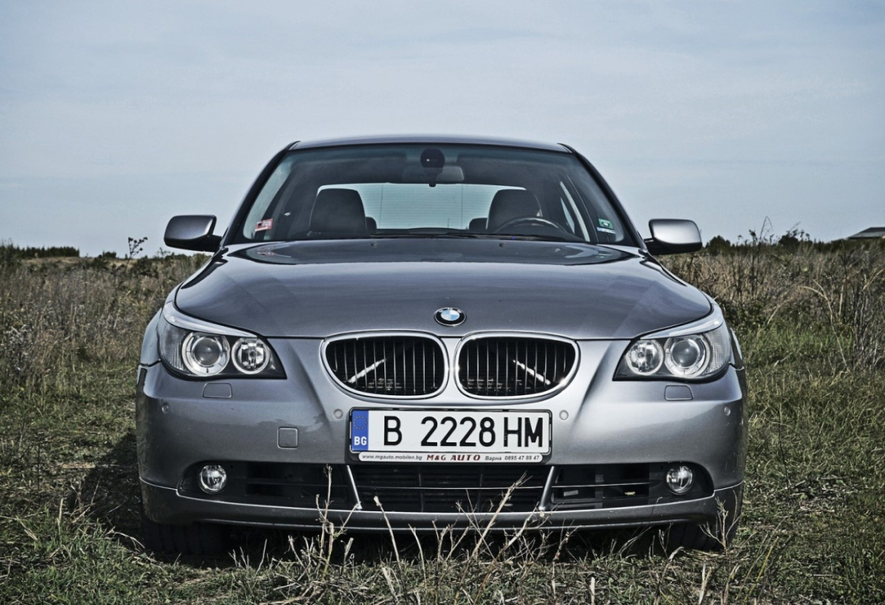

# Reconhecimento de placas

#### O projeto realiza a detecção de placas de veículos em imagens e o reconhecimento de texto nas placas usando YOLOv3 para detecção e EasyOCR para reconhecimento óptico de caracteres (OCR).

### Imagem Base

### Delimitação da placa

###  Recorte da placa da foto orignal

##### Somente a area de interece da imagem

###  Binarizção da palca

##### Converte as cores da imagem para preto e branco, facilitando a leitura dos caracteres pelo OCR

###  Leitura dos caracteres

##### Utiliza o OCR para ler os caracteres da palca, e os disponibiliza junto a imagem

#### autor:Leon Dode Junior